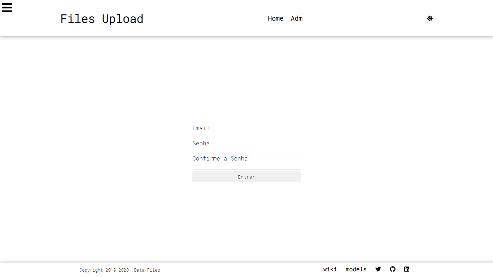
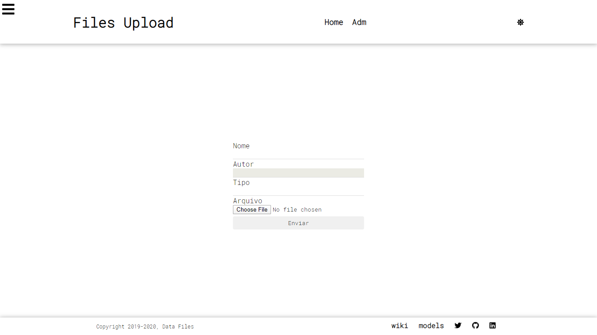
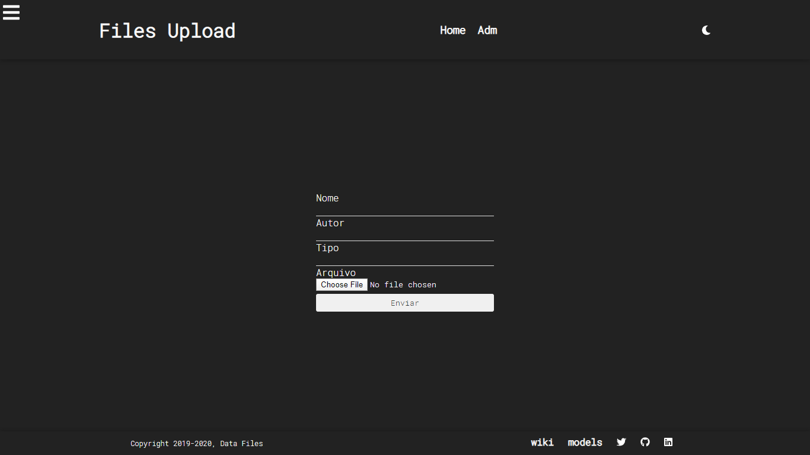

# Data Files
<div>
 
    </div>






Dark Mode



The Project was created in reactJs and NodeJs, it can store data and files local.

## Prerequisites

```
NodeJs
```

## Installing
    yarn init
    or
    npm init
## Execute
Rotes in Insomnia

[](https://insomnia.rest/run/?label=Awesome%20Api&uri=https%3A%2F%2Fraw.githubusercontent.com%2Flucasnetwork%2FFiles-Upload%2Fmaster%2FInsomnia-Routes-test.json)

    cd web - yarn start
    cd backend - yarn start
## Author
*  **Lucas Ribeiro** [LucasNetwork](https://github.com/LucasNetwork)
